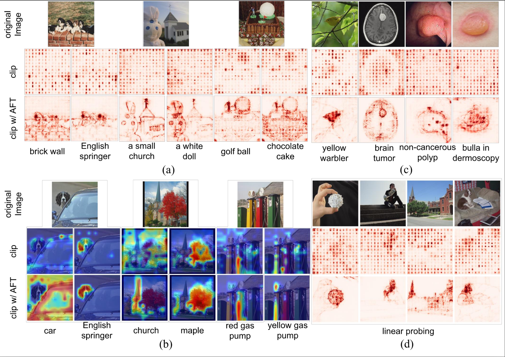

# Boosting the visual interpretability of CLIP via adversarial fine-tuning

Implementation for ICLR 2025 paper [Boosting the visual interpretability of CLIP via adversarial fine-tuning](https://openreview.net/forum?id=khuIvzxPRp)
 by [Shizhan Gong](https://peterant330.github.io/), [Haoyu Lei](lh218.github.io), [Qi Dou](https://www.cse.cuhk.edu.hk/~qdou/), and [Farzan Farnia](https://www.cse.cuhk.edu.hk/~farnia/)

## Sample Results

Figure. (a,b) Comparison of Simple Gradients/Grad-Cam between CLIP w/wo AFT. AFT greatly
improves the visual quality. (c) Evaluation of Simple Gradients on out-of-distribution dataset. (d)
Evaluation of Simple Gradients with linear probing. The improvements of visual interpretability
stem from AFT can transfer across datasets and to different tasks.

## Setup
We recommend to install the environment through
```
pip install -r requirements.txt
```

## Training

Please use the following code for adversarial fine-tuning. Note the parameters including imagenet_root, output_dir, and experiment_name should be changed.
 Also clip_model_name and pretrained can be changed according to the specific pre-trained models to be AFT.

```
python -m train.adversarial_training_clip --clip_model_name ViT-B-16 --pretrained openai --dataset imagenet 
--imagenet_root IMAGENET_ROOT --template std --output_normalize True --steps 20000 -
-warmup 1400 --batch_size 128 --loss l2 --opt adamw --lr 1e-5 --wd 1e-4 --attack pgd --inner_loss l2 
--norm huber --eps 1 --eps2 1 --iterations_adv 10 --stepsize_adv 1 --wandb False 
--output_dir OUTPUT_DIR --experiment_name EXP_NAME --log_freq 10 --eval_freq 10
```

## Interpretation
Please refer to `interpretation.ipynb` for generating Simple Gradients and Grad-Cam for CLIP model.


## Pre-trained Checkpoint
Our pretrained checkpoint can be downloaded through one-drive.

[ViT-L-14](https://mycuhk-my.sharepoint.com/:u:/g/personal/1155187960_link_cuhk_edu_hk/EfUVcY67_xdIi-Q9sfBNWhEBiPAeY3Zu-uAo4XyUdqk2wQ?e=IlEVfy)

[ViT-B-16](https://mycuhk-my.sharepoint.com/:u:/g/personal/1155187960_link_cuhk_edu_hk/Efh-YY7miV9LtDkuLf8ci-MBbd7nLSHsgGE_lIEHnF-ZQA?e=CVew1G)

[RN50](https://mycuhk-my.sharepoint.com/:u:/g/personal/1155187960_link_cuhk_edu_hk/Ebph4gnSDdVMv01en-tdRycBLu3yMUC0n2zXJnkAn1DXeQ?e=kieCYk)

## Bibtex

If you find this work helpful, you can cite our paper as follows:

```
@inproceedings{
gong2025boosting,
title={Boosting the visual interpretability of CLIP via adversarial fine-tuning},
author={Shizhan Gong and Haoyu LEI and Qi Dou and Farzan Farnia},
booktitle={The Thirteenth International Conference on Learning Representations},
year={2025},
url={https://openreview.net/forum?id=khuIvzxPRp}
}
```

## Acknowledgement

Our work is based on the codebase of the previous work including [OpenCLIP](https://github.com/mlfoundations/open_clip),
[RobustVLM](https://github.com/chs20/RobustVLM), [CLIP-Dissect](https://github.com/Trustworthy-ML-Lab/CLIP-dissect),
[VLM-visualizer](https://github.com/zjysteven/VLM-Visualizer), and [CLIP-benchmark](https://github.com/LAION-AI/CLIP_benchmark).


## Contact
For any questions, please contact <a href="mailto:szgong22@cse.cuhk.edu.hk">szgong22@cse.cuhk.edu.hk</a>
